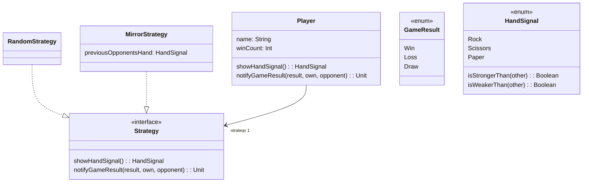

# SE-Tutorium 4 | Mittwoch 16 - 18 Uhr:
anchored to [[191.00_anchor]]

---

## Lernziele:

- Beispielklausur anschauen und durchgehen [[Probeklausur(1).pdf]]
- Konzept von CI verstehen
- Continuos Integration anschauen und probieren
- richtiges Branchen mit Git! 
- UML Diagramme lesen und verstehen können
- Ein UML Diagramm vage in Code umformen können

---

## | Orga | Aktuelle Abgaben
- **HW8** (weiterhin machbar!)-> bis zum **28.01**
- **letzte HW** 11 nun verfügbar!
	- Teams erstellen
- gerne zum Helpdesk jeden Freitag **16-18 Uhr** auf dem Sand kommen :)
- Korrektur HW7 online, Hw9 folgt die Woche

---

## | Probeklausur | Plan 
- Grading-System kurz besprechen
	- bei Multiple-Choice : same as in Info1
- kurz durchgehen | Aufgaben überfliegen
- etwa 20 - 30 **min Arbeitszeit** geben 
- anschließend gemeinsam kurz durchgehen und drüber sprechen

---

# | Probeklausur | 

note:

Its to be seen that the first task was taken from a previous tutorial-exercise ( and before part of last years ) --> https://github.com/se-tuebingen-exercises-ws23/ex6-tut4/blob/main/tut0/src/main/scala/Histogram.scala 
the question about **partitioning** input/output to equivalence classes comes from the idea / steps for **Testing** --> the slides again 

the last few **multiple choice questions** are taken from the **Quizzes from the script**, once again the link to it: https://se.cs.uni-tuebingen.de/teaching/ws23/se/skript/design-by-contract/subtyping.html ( and all the other slides available)

This test exam is way shorter than the actual one yet the questions here are **similar** in their style and scope / amount of work.

---

## Continuous Integration (CI) | Idee

- **Szenario**: 10 Personen arbeiten an einer Codebase 
	- **jede Person** bearbeitet anderen Teil
	- **aber** alle Teile hängen voneinander ab 
- wir arbeiten ewig lang an einem Feature ( dabei ist main jetzt 50commits ahead ( 5x merged PRS mit Features))
- --> **Wir wollen mergen**, weil Fertig!
- welcome to "**integration hell**" !
	- main komplett anders
	- unsere Changes funktionieren nicht mit main-code ( da anders / implementation changed )
- have fun working on that!

---

## Continuous Integration (CI) | Umsetzung
- **Codebase** aller Arbeitender sollte nicht **stark divergieren**
	- also möglichst aktuell halten!
	- contracts nicht brechen!
**Daher**:
- frequent Updates auf _main_ bringen --> alle sollten aktuellen Stand haben 
- **lokale Unit tests** vor Commit auf Main! --> garantieren, dass man andere Teile des Codes nicht killt

---

- tests im Repo, die die **Codebase** aktuell halten
	- linter für formatting
	- compile / build software --> still compilable ???
	- extract / update Documentation --> extract from code and generate one 
- kann noch mit **CD** - Continuous Delivery - kombiniert werden 

note: 
CD meint hier **Continuous delivery**, wo es darum geht, dass man möglichst immer Code haben sollte, der released werden kann. 
Bei Änderung der Codebase werden so etwas bestimmte Teile neu kompiliert, Tests durchlaufen und somit ein Zustand geprüft und erreicht, der sagt "jo, kann man releasen!"

---

## Continuous Integration (CI) | Umsetzung 
- CI somit **nicht nur lokal**, sondern auch auf dem REPO, wo man gemeinsam arbeitet, aktiv
- Git-Hoster, wie **GIthub,Codeberg,Gitlab** etc bieten Tools dafür an 
	- bei uns etwa automatisch nach scalafmtAll ausführen und schauen, ob es übereinstimmt!
	- gegen geheime Tests bei HW10 testen und somit Code Coverage angeben
	- angeben, dass code nicht kompilieren konnte --> "All checks failed" 

---

## Continuous Integration (CI) | Warum ? 
- Code **aktuell halten**
- **Fehler** schnell finden --> testing, was Funktionalität einer Version abdecken kann
- **automation** --> weniger Arbeit
- **einfacher zusammenarbeiten** --> _hopefully_ no integration hell

--> Wichtig fürs Teamprojekt oder andere Projekte mit mehreren Menschen 

---

## CI selbst erleben! 

>[!Task] folgender Task aus REPO
> 1. create githup repo ( with all its necessary information ) for a test program 
> 2. initialize locally on your system!
> 3. add the person next to you to your repo --> as **contributor** 
> 4. push something, a **hello world** program to your repo ( language you like )
> **NOW CI**:
> - got to **actions-tab** on github 
> - examine workflows for your language ( suggested ones) **chose one** and configure it 
> - test / use it! 

note: 
_we skipped it in the tutorial but I **recommend you to** go through those steps or at least **consider CI** for your teamproject._

---

## UML - Unified Modelling Language | Motivation

- **Szenario**: 
- Ich beschreibe euch mein cooles Projekt, welches so und so kommuniziert und hier Klasse, Interface da 
- **DU** beschreibst mir genau das gleiche, aber anders betrachtet / beschrieben / gedacht
- **Problem**: --> Wir meinen dasselbe, aber es wird verschieden dargestellt
- **Lösung**: Universelle Modellierung, um solche Konzepte darstellen zu können!
- **Here** comes UML - _Unified Modelling Language_

---

## UML | Definition 
- stellt **Standard** zum beschreiben / darstellen von **Diagrammen**
	- Behavior-Diagrams 
	- Interaction-Diagrams
	- **Structure-Diagrams** -> unser Fokus
- **komplex af**, aber wir müssen es bisschen lesen können!
- --> diverse Basics müssen verstanden werden, danach meist simple zu adaptieren

note:
Further information that could be of interest! 
- https://www.uml-diagrams.org/uml-25-diagrams.html
- https://dzone.com/refcardz/getting-started-uml
- https://loufranco.com/wp-content/uploads/2012/11/cheatsheet.pdf 

---

## UML | Notationen 
![[Pasted image 20240124000506.png]]

note: 
taken from aboves cheat sheet :) 

---

### UML | Example 
What does belows **UML-diagram** define / show ? 

---

## UML -> CODE 

>[!Task] UML-Diagram in Code konvertiern
>Versucht die obige Struktur **GROB** in Scala zu implemenetieren. 
>`Game.scala` kann als Hilfestellung genutzt werden
>1. als erstes grob skizzieren, wie die Struktur sein kann ( also Interfaces, Methoden), **noch keine IMplementation**
>2. anschließend Implementation beginnen
>3. **muss nicht abgeschlossen werden** --> es geht ums verstehen von UML!
